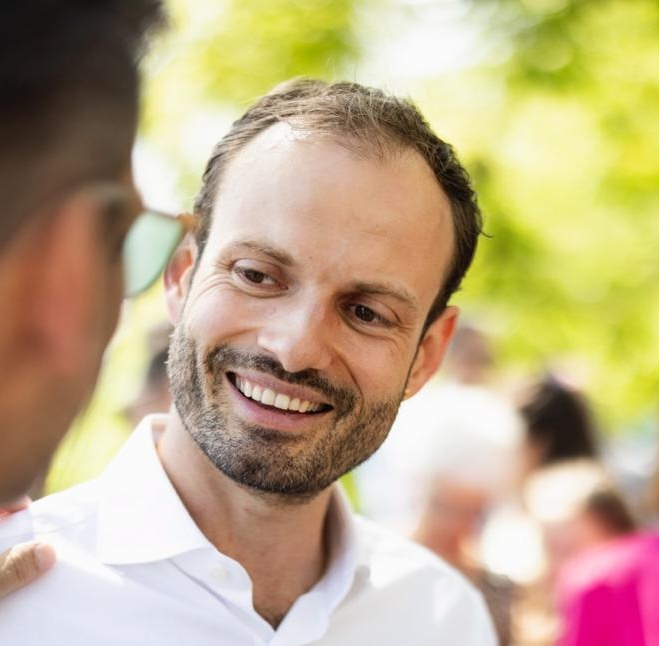

---
authors:
  - name: Moritz Mähr
    orcid: 0000-0002-1367-1618
    email: moritz.maehr@faculty.unibe.ch
    affiliations:
      - University of Bern
      - University of Basel
    role: author
lang: en
language: 
  title-block-published: "Updated"
date: last-modified
date-format: long
# date-meta: last-modified
# date-modified: last-modified
# bibliography: references.bib
pagetitle: Personal Website of Dr. sc. Moritz Mähr
# title: Personal Website
# subtitle: Dr. sc. Moritz Mähr, Associate Researcher in Digital Humanities
copyright: 
  holder: Moritz Mähr
  year: 2024
# license:
#   text: > 
#     Permission is granted to copy, distribute and/or 
#     modify this document under the terms of the GNU Free 
#     Documentation License, Version 1.3 or any later version 
#     published by the Free Software Foundation; with no 
#     Invariant Sections, no Front-Cover Texts, and no 
#     Back-Cover Texts. A copy of the license is included in 
#     the section entitled "GNU Free Documentation License
#   type: open-access
#   url: https://www.gnu.org/licenses/fdl-1.3-standalone.html
keywords:
  - Digital History
  - Digital Humanities
  - Open Science
  - Open Access
  - Open Source
# key-points:
#   - Key point 1 (1 sentence)
#   - Key point 2 (1 sentence)
#   - Key point 3 (1 sentence)
description-meta: Dr. sc. Moritz Mähr is an Associate Researcher in Digital Humanities at the University of Bern and the digital project manager of Stadt.Geschichte.Basel at the University of Basel. He studied history and philosophy of knowledge, computer science, and banking and finance in Zurich and Berlin. From 2018 to 2022, he was a research assistant at the Chair for the History of Technology at ETH Zurich. He wrote a dissertation on the digitization of migration authorities in Switzerland in the 1960s. The study was part of the SNSF-funded project Trading Zones. His research interests include science and technology studies, digital humanities, and the history of computing. He is an advocate of open science, open access and open source.

abstract: |
  Dr. sc. Moritz Mähr is an Associate Researcher in [Digital Humanities](https://www.dh.unibe.ch/) at the University of Bern and the digital project manager of [Stadt.Geschichte.Basel](https://www.stadtgeschichtebasel.ch/) at the University of Basel. He studied history and philosophy of knowledge, computer science, and banking and finance in Zurich and Berlin. From 2018 to 2022, he was a research assistant at the Chair for the History of Technology at ETH Zurich. He wrote a dissertation on the [digitization of migration authorities in Switzerland in the 1960s](https://doi.org/10.3929/ethz-b-000587758). The study was part of the SNSF-funded project [Trading Zones](https://data.snf.ch/grants/grant/188795). His research interests include science and technology studies, digital humanities, and the history of computing. He is an advocate of open science, open access and open source.
---

<!-- Dr. sc. Moritz Mähr is an Associate Researcher in [Digital Humanities](https://www.dh.unibe.ch/) at the University of Bern and the digital project manager of [Stadt.Geschichte.Basel](https://www.stadtgeschichtebasel.ch/) at the University of Basel. He studied history and philosophy of knowledge, computer science, and banking and finance in Zurich and Berlin. From 2018 to 2022, he was a research assistant at the Chair for the History of Technology at ETH Zurich. He wrote a dissertation on the [digitization of migration authorities in Switzerland in the 1960s](https://doi.org/10.3929/ethz-b-000587758). The study was part of the SNSF-funded project [Trading Zones](https://data.snf.ch/grants/grant/188795). His research interests include science and technology studies, digital humanities, and the history of computing. He is an advocate of open science, open access and open source. -->

## Curriculum Vitae

Dr. sc. Moritz Mähr  
University of Bern  
Walter Benjamin Kolleg  
Digital Humanities  
Muesmattstrasse 45  
3012 Bern  
Switzerland  
ORCID [0000-0002-1367-1618](https://orcid.org/0000-0002-1367-1618)  
[moritz.maehr@faculty.unibe.ch](mailto:moritz.maehr@faculty.unibe.ch)

\* December 31, 1987, Swiss Citizen

### Current positions and affiliations

**University of Bern**, Bern, CH  
Associated Researcher, February 2023-Present

**University of Basel**, Basel, CH  
Project Manager, October 2021-Present

### Education

**ETH Zurich**, Zurich, CH  
Dr. sc. ETH Zurich, History of Technology, 2022

**ETH Zurich**, Zurich, CH  
Master of Arts, _with honors_, History and philosophy of knowledge, 2014

**University of Zurich**, Zurich, CH  
Bachelor of Arts, _magna cum laude_, Banking and Finance, 2011

### Former positions and affiliations

**University of Bern**, Bern, CH  
IFN Postdoctoral Research Fellow, August 2022-January 2023

**Chair for History of Technology & Collegium Helveticum, ETH Zurich**, Zurich, CH  
Research assistant, February 2018-April 2022

**Department of Informatics, University of Zurich**, Zurich, CH  
Tutor and teaching assistant, 2008-2009

### Teaching experience

Mähr, Moritz. “How to Organize Your Research (Digitally).” Presented at the Seminar DH Lab (fall semester 2024), University of Bern, April 16, 2024.

Mähr, Moritz. “Mit ChatGPT Texte schreiben: Prompting-Methoden für Historiker:innen.” Workshop presented at the Dozierenden-Workshop des historischen Seminars, University of Zurich, March 15, 2024. [https://zenodo.org/doi/10.5281/zenodo.10815356](https://zenodo.org/doi/10.5281/zenodo.10815356).

Mähr, Moritz. “Mit ChatGPT Texte schreiben: Prompting-Methoden für Historiker:innen.” Seminar Session presented at the Geschichte schreiben mit künstlicher Intelligenz (600k506a), University of Zurich, March 8, 2024. [https://doi.org/10.5281/zenodo.10815218](https://doi.org/10.5281/zenodo.10815218).

Mähr, Moritz. “The Corpus as a Network. Turning Source Documents into a Graph with NLP.” Presented at the Lecture series Einblicke in die Digital Humanities (fall semester 2022), University of Bern, December 12, 2022. [https://doi.org/10.5281/zenodo.7430555](https://doi.org/10.5281/zenodo.7430555).

Mähr, Moritz. “The Automation of Migration Policy in Switzerland in the 1960s.” Seminar Session presented at the Interdisciplinary Seminar on Migration and Mobility, ETH Zurich, March 25, 2022. [https://doi.org/10.3929/ethz-b-000538201](https://doi.org/10.3929/ethz-b-000538201).

Mähr, Moritz. “Arbeiten mit (vielen) retrodigitialisierten Quellen: Texterkennung und Metadatenextraktion in PDF-Dateien mit freier Software.” Workshop presented at the Praxislabor at Historikertag 2021, online, July 13, 2021.

Mähr, Moritz. “Review (Sitzung 11).” Seminar Session presented at the Schreibübung (600-009a), University of Zurich, May 5, 2020. [https://doi.org/10.3929/ethz-b-000413518](https://doi.org/10.3929/ethz-b-000413518).

Mähr, Moritz. “Knoten & Kanten. Einführung in die Analyse sozialer Netzwerke.” Workshop presented at the Digital Masterclass at Bauhaus-Universität Weimar, Bauhaus-Universität Weimar, February 8, 2019.

Mähr, Moritz. “E-Mail wird 36 Jahre alt. Zeit für eine Quellenkritik.” Lecture presented at the Digital Masterclass, Bauhaus-Universität Weimar, February 7, 2019. [https://doi.org/10.3929/ethz-b-000324252](https://doi.org/10.3929/ethz-b-000324252).

### Supervision

Guyot, Nina, “inhabiting zurich”, MA thesis, ETH Zurich, supervisor Alexandre Theriot, co-supervisor Moritz Mähr, 2021.

### Organisation of conferences, workshops and panels

Baudry, Jérôme, Burkart, Lucas, Joyeux-Prunel, Béatrice, Kurmann, Eliane, Mähr Moritz, Natale, Enrico, Sibille, Christiane, and Twente, Moritz. [Digital History Switzerland 2024](https://bit.ly/digihistch24) at University of Basel, September 12 and 13, 2024.

Amsler, Claudia, Atanasiu, Vlad, Baumann, Jan, Camus, Alexandre, Cardozo Sarli, André, Chiquet, Vera, Hodel, Tobias, Mähr, Moritz, Mazel-Cabasse, Charlotte, Natale, Enrico, Pidoux, Jessica and Tanferri Machado, Mylène. Unconference [“Critique Digitale”](https://critique-digitale.ch/), online, October 21 and 22, 2021.

Krauer, Philipp, Mähr, Moritz, and Schwery, Nick. [“Digitale Werkzeuge in der Quellenarbeit”](https://www.tg.ethz.ch/fileadmin/redaktion/dokumente/Personen_pdfs/Digitale_Werkzeuge_in_der_Quellenarbeit_def.pdf) at Collegium Helveticum, Zurich, February 14, 2019.

Leins, Stefan, and Mähr, Moritz. [“Das Wissen der Finanzmärkte”](https://www.zgw.ethz.ch/fileadmin/ZGW/veranstaltungen/2015/Wissen_der_Finanzm%C3%A4rkte_ifw.pdf) at Center for History of Knowledge of ETH Zurich and University of Zurich, Zurich, March 16, 2015.

### Service and affiliations

Member of the [Advisory Board](https://opendata.ch/advisory-board/) of [OpenData.ch](https://opendata.ch/)  
Founding member of [Digital History Network Switzerland](https://www.digitalhistorynetwork.ch/)  
Member of [DHd](https://dig-hum.de/)  
Member of [Digitale Gesellschaft](https://www.digitale-gesellschaft.ch/)  
Member of [Geschichte & Informatik Schweiz](http://blog.ahc-ch.ch/)  
Member of [SGG](https://www.sgg-ssh.ch/)

### Languages

**German**, Native

**English**, Advanced (C1)  
Cambridge English Level 2 Certificate in ESOL International (Advanced)

**Spanish**, Advanced (C1)  
Universidad Nacional de Córdoba, CELU Intermedio c. m. excelente  
Language Center of the University of Zurich and ETH Zurich C1

**French**, Intermediate (B2)

### Qualification in higher education didactics

Teaching scientific writing skills (2019)

Optimize my performance with voice and presentation technique (2021)

## Publications

### Articles in peer-reviewed journals and edited volumes

Mähr, Moritz. “Die Geschichte von Basel ins Netz stellen: Beteiligung relevanter Anspruchsgruppen an der Entwicklung eines nachhaltigen und offenen Public-History-Portals.” In _Zusammenarbeit klug gestalten: Projektmanagement und Digital Humanities_, edited by Fabian Cremer, Swantje Dogunke, Anna Maria Neubert, and Thorsten Wübbena. Digital Humanities Research 9. Bielefeld: Bielefeld University Press, 2024. [https://www.transcript-open.de/doi/10.14361/9783839469675-007](https://www.transcript-open.de/doi/10.14361/9783839469675-007).

Diekjobst, Anne, Tim Geelhaar, Tobias Hodel, Moritz Mähr, and Melanie Seltmann. “Mit Standards forschen und Handlungsräume schaffen.” In _Living Handbook “Digitale Quellenkritik,”_ edited by Aline Deicke, Jonathan G. Geiger, Marina Lemaire, and Stefan Schmunk, 2024. [https://doi.org/10.5281/zenodo.12656766](https://doi.org/10.5281/zenodo.12656766).

Mähr, Moritz. “The Promise of an Automated Migration Policy: On Planning an Information System in the Swiss Federal Administration in the 1960s.” In _Digital Federalism Information, Institutions, Infrastructures (1950–2000)_, edited by Paolo Bory and Daniela Zetti, 60–89. Itinera. Beihefte Zur Schweizerischen Zeitschrift Für Geschichte 49. Basel: Schwabe, 2022. [https://doi.org/10.24894/978-3-7965-4509-2](https://doi.org/10.24894/978-3-7965-4509-2).

Mähr, Moritz, and Kijan Espahangizi. “Computing Aliens. From Central Control to Migration Scenarios, 1960-1990.” In _Data Centers. Edges of a Wired Nation._, edited by Monika Dommann, Hannes Rickli, and Max Stadler, 226–41. Zurich: Lars Müller Publishers, 2020.

Mähr, Moritz. “Working with Batches of PDF Files.” _Programming Historian_ 9 (2020). [https://doi.org/10.46430/phen0088](https://doi.org/10.46430/phen0088).

Mähr, Moritz. “CTRL + F. Eine Suchmaschine für die Quellenarbeit bauen.” _etü_, no. II (2020): 88–91. [https://doi.org/10.3929/ethz-b-000449830](https://doi.org/10.3929/ethz-b-000449830).

Federer, Lucas, and Moritz Mähr. “Bewegte Quellen festhalten. Wie wird in Zukunft auf digital verfügbare audiovisuelle Quellen verwiesen?” _Traverse_ 27, no. 3 (2020): 159–66. [https://doi.org/10.5169/seals-914091](https://doi.org/10.5169/seals-914091).

Espahangizi, Kijan, and Moritz Mähr. “The Making of a Swiss Migration Regime. Electronic Data Infrastructures and Statistics in the Federal Administration, 1960s–1990s.” _Journal of Migration History_ 6, no. 3 (October 8, 2020): 379–404. [https://doi.org/10.1163/23519924-00603005](https://doi.org/10.1163/23519924-00603005).

Mähr, Moritz. “Blaupause einer flexiblen Lebensform.” In _In Ordnung_, 88–91. Trans 21. Zürich: gta Verlag, 2012. [https://doi.org/10.3929/ethz-b-000449826](https://doi.org/10.3929/ethz-b-000449826).

### Presentations

Mähr, Moritz. “Online-Sammlungen mit FAIR-Daten und Open Source Software erstellen: Eine Einführung in CollectionBuilder.” Presentation presented at the Coffee lecture, University of Bern, December 3, 2024.

Görlich, Nico, Moritz Mähr, Moritz Twente, and Cristina Wildisen-Münch. “Accessible Public History: Digitale Sammlungen mit CollectionBuilder selbst erstellen.” Workshop presented at the Praxislabor at Historikertag 2024, online, October 15, 2024. [https://doi.org/10.58079/11sc7](https://doi.org/10.58079/11sc7).

Görlich, Nico, Moritz Mähr, Moritz Twente, and Cristina Wildisen-Münch. “Accessible Public History: Digitale Sammlungen mit CollectionBuilder selbst erstellen.” Workshop presented at the Digital History & Citizen Science, University of Halle, September 21, 2024. [https://www.geschichte.uni-halle.de/struktur/hist-data/dh_cs/](https://www.geschichte.uni-halle.de/struktur/hist-data/dh_cs/).

Mähr, Moritz. “Fast Prototyping: CollectionBuilder’s Minimal Computing Approach to Open-Source Collections and Exhibits.” Lighting talk presented at the RSE Meetup, ETH Zurich, June 4, 2024. [https://doi.org/10.5281/zenodo.11190199](https://doi.org/10.5281/zenodo.11190199).

Mähr, Moritz. “Werkstattbericht: Das neue Portal der Stadtgeschichte.” Presentation presented at the Vortragszyklus der Historisch Antiquarischen Gesellschaft Basel (HAG), Naturhistorisches Museum Basel, March 4, 2024. [https://doi.org/10.5281/zenodo.10780215](https://doi.org/10.5281/zenodo.10780215).

Mähr, Moritz. “Die Geschichte von Basel ins Netz stellen: Mit Forschungsdaten Public History schreiben.” Presentation presented at the Doing Digital Public History, Zentralbibliothek Zürich, February 2, 2024. [https://doi.org/10.5281/zenodo.10602603](https://doi.org/10.5281/zenodo.10602603).

Mähr, Moritz. “Digital Longevity: Learnings from the (Digital) History Project Stadt.Geschichte.Basel.” Paper presented at the Legal History Meets Digital Humanities, Max Planck Institute for Legal History and Legal Theory, December 12, 2023. [https://doi.org/10.5281/zenodo.10368874](https://doi.org/10.5281/zenodo.10368874).

Mähr, Moritz. “Accessible Public History: CollectionBuilder’s Minimalist Approach to Open-Source Collections and Exhibits.” Infrastructure pitch presented at the DARIAH-CH Study Day, University of Bern, October 20, 2023. [https://doi.org/10.5281/zenodo.10003519](https://doi.org/10.5281/zenodo.10003519).

Mähr, Moritz. “The Reconstruction of the Central Aliens Register: Early Database Systems in the Swiss Federal Administration as a Subject of Historical Research.” Paper presented at the Database Histories – Histories of Databasing and Databasing of History, University of Basel, June 23, 2023. [https://www.hsozkult.de/event/id/event-136204](https://www.hsozkult.de/event/id/event-136204).

Mähr, Moritz. “Research Data Management and Public History.” Lecture presented at the RISE (Internal Lecture Series), University of Basel, June 21, 2023. https://doi.org/10.5281/zenodo.11106921.

Mähr, Moritz. “Literature Research with ChatGPT: Excerpting and Summarizing for the Impatient Researcher.” Paper presented at the Interaktive Sprachmodelle: Lehre und Forschung mit ChatGPT & Co, University of Bern, April 21, 2023. [https://doi.org/10.48350/181897](https://doi.org/10.48350/181897).

Kury, Patrick, and Moritz Mähr. “New urban history am Beispiel von Basel - analog und digital.” Paper presented at the Forschungskolloquium des Historischen Seminars, University of Lucerne, April 18, 2023. [https://www.unilu.ch/fakultaeten/ksf/institute/historisches-seminar/veranstaltungen/new-urban-history-am-beispiel-von-basel-analog-und-digital-7302/](https://www.unilu.ch/fakultaeten/ksf/institute/historisches-seminar/veranstaltungen/new-urban-history-am-beispiel-von-basel-analog-und-digital-7302/).

Mähr, Moritz. “Die Entwicklung der Internet Governance: Wie kann ein grosses Korpus an digital entstandenen Quellen in einem kollaborativen Forschungsprojekt untersucht werden?” Paper presented at the Forschungskolloquium zur Geschichte nach 1800, University of Bern, March 1, 2023. [http://doi.org/10.48350/179388](http://doi.org/10.48350/179388).

Wildisen-Münch, Cristina, Nico Görlich, and Moritz Mähr. “Teach Historians How to Design a Data Story: Stadt.Geschichte.Basel.” Poster Slam presented at the DARIAH-CH Study Day, Università della Svizzera Italiana (USI), Mendrisio, Switzerland, October 20, 2022. [https://doi.org/10.5281/zenodo.7198056](https://doi.org/10.5281/zenodo.7198056).

Mähr, Moritz. “Wer entscheidet darüber, wie das Internet funktioniert?” Presented at the 8. Tag der Junior Fellows, Walter Benjamin Kolleg der Universität Bern, October 1, 2022. [https://doi.org/10.48350/173623](https://doi.org/10.48350/173623).

Mähr, Moritz. “Research Data Management in (Public) History.” Key note presented at the Digital Humanities Methodologies DHCH 2022, Istituto Svizzero di Roma, June 15, 2022. [https://doi.org/10.5281/zenodo.6637118](https://doi.org/10.5281/zenodo.6637118).

Mähr, Moritz. “Wie der Verwaltungscomputer die Arbeitsmigration programmierte. Elektronische Datenverarbeitung in der Bundesverwaltung 1964–1982.” Presented at the Oberseminar Sommersemester 2022, Deutsches Museum, May 30, 2022. [https://doi.org/10.3929/ethz-b-000549787](https://doi.org/10.3929/ethz-b-000549787).

Mähr, Moritz. “Wie der Verwaltungscomputer die Arbeitsmigration programmierte: Elektronische Datenverarbeitung in der Bundesverwaltung 1964–1982.” Defense, ETH Zurich, April 25, 2022. [https://www.research-collection.ethz.ch/handle/20.500.11850/587764](https://www.research-collection.ethz.ch/handle/20.500.11850/587764).

Mähr, Moritz. “The Public, the Private, and the Domestication of the Information System. How Data Protection Governed the Swiss Administration in the 1970s.” Paper presented at the 6th International Conference on the History and Philosophy of Computing, Zurich, October 27, 2021. [https://doi.org/10.3929/ethz-b-000512153](https://doi.org/10.3929/ethz-b-000512153).

Mähr, Moritz, Henrike Hoffmann, and Daniela Zetti. “How the Search Engine Came to the Historians.” Presented at the Sharing the Experience: Workflows for the Digital Humanities (DARIAH-DESIR Workshop), University of Neuchâtel, December 6, 2019. [https://doi.org/10.3929/ethz-b-000384360](https://doi.org/10.3929/ethz-b-000384360).

Mähr, Moritz. “Auf Magnetband gespeicherte Ausländer. Steuerung der Arbeitsmigration in der Schweiz nach 1960.” Paper presented at the Forschungskolloquiums zur Geschichte der vormodernen und modernen Welt, Universität of Lucerne, July 5, 2019. [https://doi.org/10.3929/ethz-b-000390398](https://doi.org/10.3929/ethz-b-000390398).

Mähr, Moritz. “Auf Magnetband gespeicherte Ausländer. Steuerung der Arbeitsmigration zur Sicherung des Wohlstands nach 1960.” Paper presented at the Panel “Wie wird der Zusammenhang von Reichtum, Arbeit und Migration in der Schweiz in neueren Publikationen und Projekten thematisiert?” (5. Schweizerischen Geschichtstage), University of Zurich, June 6, 2019. [https://doi.org/10.3929/ethz-b-000347897](https://doi.org/10.3929/ethz-b-000347897).

Mähr, Moritz. “Netzwerke als Suchstrategie.” Presented at the Workshop “Digitale Werkzeuge in der Quellenarbeit,” Collegium Helveticum Zurich, February 14, 2019.

Mähr, Moritz. “E-Mail wird 36 Jahre alt. Zeit für eine Quellenkritik.” Paper presented at the Research Network “Computer, administration, and history,” IKKM Weimar, December 4, 2018.

Mähr, Moritz. “Die Fremden und der Computer: Die Entstehung des zentralen Ausländerregisters in den 1970er und 1980er Jahren.” Paper presented at the Migration and Postcoloniality Meet Switzerland Workshop of University of Fribourg, Centre Loewenberg Murten, October 26, 2018.

Mähr, Moritz. “Heldengeschichten und Feldforschung: Ein kritischer Blick auf die Social Studies of Finance.” Paper presented at the Das Wissen der Finanzmärkte (ZGW Workshop), ETH Zurich, March 16, 2015. [https://web.archive.org/web/20191216201059/https://voicerepublic.com/talks/heldengeschichten-und-feldforschung](https://web.archive.org/web/20191216201059/https://voicerepublic.com/talks/heldengeschichten-und-feldforschung).

### Posters

Wildisen-Münch, Cristina, Nico Görlich, Moritz Mähr, and Moritz Twente. “Karten als ‘boundary objects’ oder wie man mit Geodaten historische Thesen bildet.” Presented at the Digital History Tagung 2023 Humboldt-Universität zu Berlin, Berlin, May 23, 2023. [https://doi.org/10.5281/zenodo.7960745](https://doi.org/10.5281/zenodo.7960745).

Wildisen-Münch, Cristina, Nico Görlich, and Moritz Mähr. “How to Tell a Data Story.” Poster presented at the DARIAH-CH Study Day, Università della Svizzera Italiana (USI), Mendrisio, Switzerland, October 20, 2022. [https://doi.org/10.5281/zenodo.7193613](https://doi.org/10.5281/zenodo.7193613).

Mähr, Moritz, Henrike Hoffmann, and Daniela Zetti. “Topic Modelling and Explorative Search.” Poster presented at the DARIAH CH Workshop at University of Neuchâtel, Neuchâtel, November 29, 2018. [https://doi.org/10.3929/ethz-b-000311816](https://doi.org/10.3929/ethz-b-000311816).

Mähr, Moritz. “Typademic, Collaborative Academic Publishing.” Poster presented at the DARIAH CH Workshop at University of Neuchâtel, Neuchâtel, November 29, 2018. [https://doi.org/10.3929/ethz-b-000311815](https://doi.org/10.3929/ethz-b-000311815).

Mähr, Moritz. “Topic modelling & explorative Suche.” Poster presented at the DARIAH DE Grand Tour at TU Darmstadt, Darmstadt, September 20, 2018. [https://doi.org/10.3929/ethz-b-000311814](https://doi.org/10.3929/ethz-b-000311814).

### Varia

Mähr, Moritz, and Noëlle Schnegg. _Handbuch zur Erstellung diskriminierungsfreier Metadaten für historische Quellen und Forschungsdaten_. Basel: Zenodo, 2024. [https://doi.org/10.5281/zenodo.11124720](https://doi.org/10.5281/zenodo.11124720).

Mähr, Moritz. Q&A with Moritz Mähr, Stadt.Geschichte.Basel and cb-translate. Interview by Julia Stone. Blog, April 22, 2024. [https://collectionbuilder.github.io/2024-04-22-cb-moritz-mahr/](https://collectionbuilder.github.io/2024-04-22-cb-moritz-mahr/).

Gabay, Simon, Tobias Hodel, Moritz Mähr, Stefan Nellen, Barbara Roth-Lochner, Pascale Sutter, Andrea Voellmin, and Karin von Wartburg. “Datenstandards für die historische Forschung – Ein White-Paper der Schweizerischen Gesellschaft für Geschichte.” White-Paper. Schweizerische Gesellschaft für Geschichte, November 10, 2023. [https://doi.org/10.5281/zenodo.10122052](https://doi.org/10.5281/zenodo.10122052).

Mähr, Moritz. “Embracing Endings: Principles for Digital Longevity and Their Importance for Research Software Engineers.” Blog. DHTech, August 7, 2023. [https://dh-tech.github.io/blog/2023-08-07-ending-principles/](https://dh-tech.github.io/blog/2023-08-07-ending-principles/).

Wildisen-Münch, Cristina, Nico Görlich, and Moritz Mähr. “Das Kontrollbüro und die Wundermaschine: Wie Basel-Stadt in den 1960er Jahren das Einwohnermeldewesen digitalisierte.” Data Story. ArcGIS StoryMaps, June 7, 2022. [https://storymaps.arcgis.com/stories/6be823309a7b4254aa27b5486703b68b](https://storymaps.arcgis.com/stories/6be823309a7b4254aa27b5486703b68b).

Mähr, Moritz, Malte Vogl, Diego Siqueira, Carsten Thiel, Julia Damerow, David Maus, Stefan E. Funk, and Jan Oliver Rüdiger. “Awesome Digital Humanities,” 2021. [https://dh-tech.github.io/awesome-digital-humanities](https://dh-tech.github.io/awesome-digital-humanities).

Mähr, Moritz. “Sofia Booz, Der Reißwolf. Aktenvernichtung als destruktiver, ordnender und produktiver Umgang mit Daten (1965-2015).” _TG_ 87, no. 3 (2020): 265–66. [https://doi.org/10.5771/0040-117X-2020-3](https://doi.org/10.5771/0040-117X-2020-3).

Mähr, Moritz, Henrike Hoffmann, Markus Wolfenswan, Rida Ayed, Wincent Balin, and Kieran Robson. “Awesome Digital History.” Linklist. Awesome Digital History, September 21, 2019. [https://maehr.github.io/awesome-digital-history/](https://maehr.github.io/awesome-digital-history/).

Vishnu, Ashwin, and Moritz Mähr. “Awesome Scientific Writing.” Awesome Scientific Writing, May 9, 2018. [https://writing-resources.github.io/awesome-scientific-writing/](https://writing-resources.github.io/awesome-scientific-writing/).

Mähr, Moritz, Matias Mikhail, and Andri Tschudi. “Tagungsbericht: Das Politische in der Wissensgeschichte – Perspektiven eines Forschungskonzepts, 10.04.2014 – 12.04.2014 Zürich.” H-Soz-Kult, June 24, 2014. [http://www.hsozkult.de/conferencereport/id/tagungsberichte-5437](http://www.hsozkult.de/conferencereport/id/tagungsberichte-5437).

### Thesis

Mähr, Moritz. “Wie der Verwaltungscomputer die Arbeitsmigration programmierte: Elektronische Datenverarbeitung in der Bundesverwaltung 1964–1982.” Doctoral Thesis, ETH Zurich, 2022. [https://doi.org/10.3929/ethz-b-000587758](https://doi.org/10.3929/ethz-b-000587758).

Mähr, Moritz. “Wie die Demokratie zu ihrem Wissen kommt: Über demokratisch adäquate, epistemische Mechanismen.” Master thesis, ETH Zurich, 2014. [https://doi.org/10.3929/ethz-b-000311817](https://doi.org/10.3929/ethz-b-000311817).

Mähr, Moritz. “Wer entscheidet in der Schweiz de jure und de facto über Systemrelevanz?” Bachelor thesis, University of Zurich, 2011. [https://doi.org/10.13140/RG.2.1.2270.6082](https://doi.org/10.13140/RG.2.1.2270.6082).

### Software

Mähr, Moritz, Nico Görlich, Sebastian Flick, Adrian Demleitner, and Aline Mähr. _Stadt-Geschichte-Basel/Stadtgeschichtebasel.Ch_. Stadt.Geschichte.Basel, 2023. [https://github.com/Stadt-Geschichte-Basel/stadtgeschichtebasel.ch](https://github.com/Stadt-Geschichte-Basel/stadtgeschichtebasel.ch).

Mähr, Moritz. _Maehr/Open-Research-Data-Template_, 2023. [https://github.com/maehr/open-research-data-template](https://github.com/maehr/open-research-data-template).

Mähr, Moritz. _Maehr/Academic-Pandoc-Template_, 2021. [https://zenodo.org/record/5749967](https://zenodo.org/record/5749967).

Mähr, Moritz, Tobias Hodel, and Vlad Atanasiu. _Critique-Digitale.Ch_, 2021. [https://github.com/critique-digitale/critique-digitale.ch](https://github.com/critique-digitale/critique-digitale.ch).

Mähr, Moritz. _Maehr/Uzh-Ma-Thesis_, 2020. [https://zenodo.org/record/4270126](https://zenodo.org/record/4270126).

Mähr, Moritz. _Maehr/Typademic_, 2020. [https://zenodo.org/record/4153183](https://zenodo.org/record/4153183).

Mähr, Aline, and Moritz Mähr. _Open-Museum/Web_, 2020. [https://github.com/open-museum/web](https://github.com/open-museum/web).

Mähr, Moritz. _Open-Museum/Open-Museum.Ch_, 2020. [https://github.com/open-museum/open-museum.ch](https://github.com/open-museum/open-museum.ch).

Mähr, Moritz. _Maehr/Github-Template_, 2019. [https://github.com/maehr/github-template](https://github.com/maehr/github-template).

### Datasets

Mähr, Moritz. “International Labour Office Historical Studies and Reports English.” Zenodo, December 18, 2019. [https://doi.org/10.5281/zenodo.3582818](https://doi.org/10.5281/zenodo.3582818).
